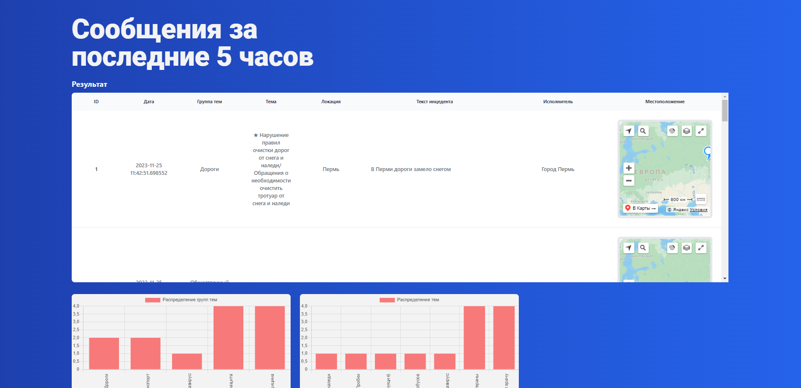

# Проект SCORIC


### *Доброго времени суток!* **Вашему вниманию** представляется сервис по обработке обращений граждан под шифром "**SCORIC**", предназначенный для решения проблемы классификации обращений граждан, а также выделения именованных сущностей.

# Требования к эксплуатации

**Для запуска приложения представлены следующие требования:**

1) *PostgreSQL => 16.0*;
2) *Python => 3.10.11*;
3) *Linux
4) *Библиотеки из requirements.txt (для работы модулей анализа и fastAPI)*;
5) *Широкополосное стабильное подключение к ИТКС "Интернет"*;
6) *Docker*

# Способы запуска проекта

❗❗❗ Модели к проекту ❗❗❗

Первый файл -- https://disk.yandex.ru/d/dwY-a9gDgA0k0Q
Второй файл -- https://disk.yandex.ru/d/Z9RnIjjo0tky0g

Распакуйте содержимое по адресу /Проект/fastApi/models

Модели загрузятся при запуске проекта сами

## С помощью контейнера

  Переходите на ветку docker, там можно сразу поднять командой `docker-compose up`


  Сервис имеет высокую адаптируемость, что позволяет его запустить в виде Docker-контейнера.

#### Подключение к БД

  Используйте файл *DB.env* в корне проекта, напишите в нем данные для подключения к БД PostgreSQL

`PRODUCTION = False`

`PORT = 5432`

`DB_HOST = db`

`POSTGRES_DB = accreditation`

`POSTGRES_USER = accreditation_user`

`POSTGRES_PASSWORD = 12345678`

`DB_LOCAL = localhost`

`LOCAL_DB = promobot`

`LOCAL_USER = postgres`

`LOCAL_PASSWORD = 12345678`

Переменная PRODUCTION отвечает за использование локальных либо переменных в Docker-окружении
True - Docker
False - Local

Соответсвенно переменные с приставкой LOCAL - параметры для БД у вас на машине,
Остальные - для подключения Docker-контейнера с PostgreSQL

#### Запуск Docker-контейнера

  Смените ветку на docker

  Перейдите в корневую директорию и выполните команду:

  `docker compose up --build`, ожидайте выполнения команды и переходите по выведенной ссылке.
  
  http://ip:8082 - Backend
  
  http://ip:8080 - Frontend
  
  ip:5432 - PostgreSQL

## Запуск приложения вручную

  В случае возникновения неполадок при сборке docker-контейнера обращайтесь к любому члену команды (можно к нему @qTemio), однако есть возможность запустить проект вручную.

#### Виртуальное окружение

Откройте терминал в project/fastApi, выполните команды:

```
python

python -m venv venv

venv\Scripts\activate

pip install -r requirements.txt
```

#### FastAPI

В папке **fastapi**, выполнить:

`uvicorn main:app --host=ваш_хост --port=ваш_порт`

После того как вы запустите свою БД, выполнив команду выше будут подняты инстансы fastApi и PostgreSQL. Далее необходимо запустить клиентскую часть приложения

#### Frontend

В папке `frontend` создайте два файла для подключения клиентской части к серверной:

1) .env
2) .env.production

В этих файлах напишите IP-адрес серверной части приложения в формате:

`VUE_APP_USER_IP_WITH_PORT = *ВАШ IP (Либо localhost)*:8082`

Откройте терминал в папке `frontend`, выполните команды:

`npm install`

`npm run serve`

После этого frontend-часть этого проекта будет доступна на *http://localhost:8080/*.

## Принцип работы проекта

Наше решение представляет собой веб-приложение с открытым API, предназначенное для тематизации обращений пользователей. В основе проекта лежат модели из фреймворка Pavlov, используемая библиотека ru_bert_uncased. 
Основной принцип работы - по адресу api/add_message_all_pavlov прилетает сообщение с текстом пользователя. Далее параллельно:
1) Определяем тему
2) Определяем группу тем
3) Определяем исполнителя
4) Вычленяем NER -> Смотрим есть ли локации (LOC) -> Смотрим координаты через GeoPy (Геокодер бесплатный, поэтому низкая точность. Для нормальной работы покупайте YandexAPI)

#### Стэк технологий:

FastAPI, VueJS, PostgreSQL, Docker (docker-compose), pavlov, nltk, sqlalchemy.

### Технические особенности:

Для адекватной работы моделей необходимо добавить данные в классах, в которых их менее 500 экземпляров.

### Уникальность:

1. Возможность определения исполнителя и геолокации.
2. Есть отрисовка популярных за последние 5 часов тематик и групп тем.
3. Возможность загрузки файла для проверки/занесения известных результатов в БД.
4. Проработан концепт для самообучающийся системы (дообучение в процессе эксплуатации)

### Скриншоты веб-страниц


  
 
